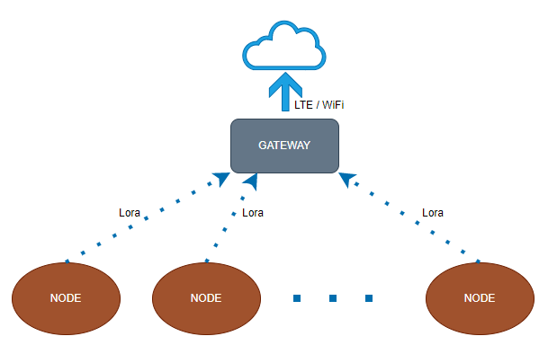
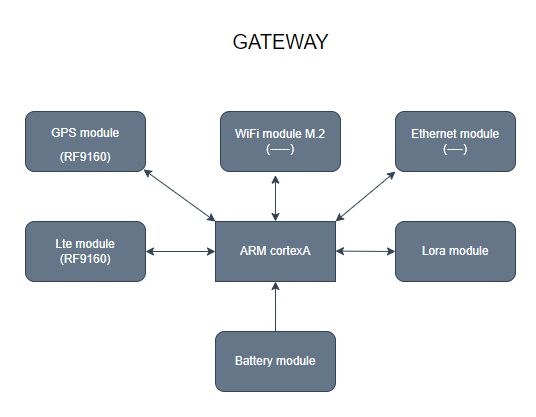
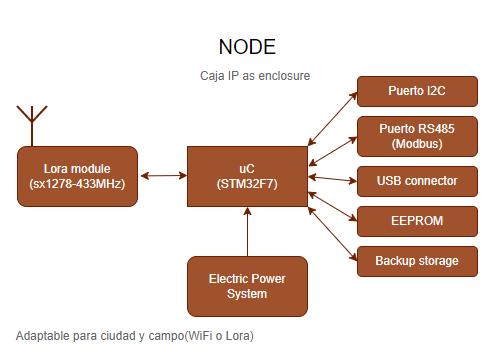

# Precision Agriculture
Design of an IoT device for agriculture properties tracking.

## General Structure
The hole system is designed in two parts, the first is one gateway that upload data to the cloud and the second are the Nodes various devices that feed the gateway with data from sensors.

## Gateway
Receive the data from the Node and is preprocessed to be sent to the cloud through LTE, Ethernet or WiFi.

## Node
Retrieve the data from sensors and send through Lora to the Gateway.

Note: *for indoor independent functionality the Lora module would be replaced for an WiFi module.*
### Electrical Power system
Design reference: [Quetzal](https://github.com/Quetzal-1-CubeSat-Team/quetzal1-hardware/tree/master/EPS)

