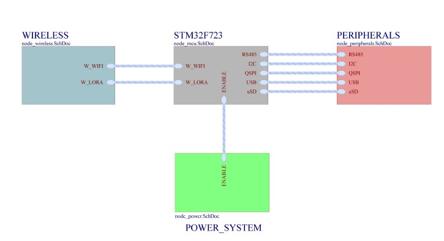
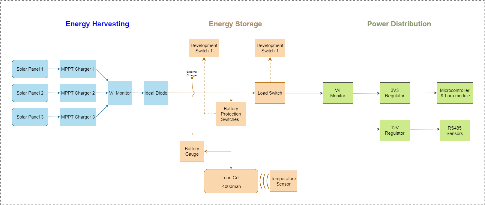

## Node
Device in charge of collect data from sensors to be delivered to the Gateway throughout Lora protocol.  

Also this device can works independently using the WiFi interface to upload directly the data to the cloud.
## Overview

## Microcontroller

## Wireless

## Peripherals

## Electrical Power system
Design reference: [Quetzal](https://github.com/Quetzal-1-CubeSat-Team/quetzal1-hardware/tree/master/EPS)
