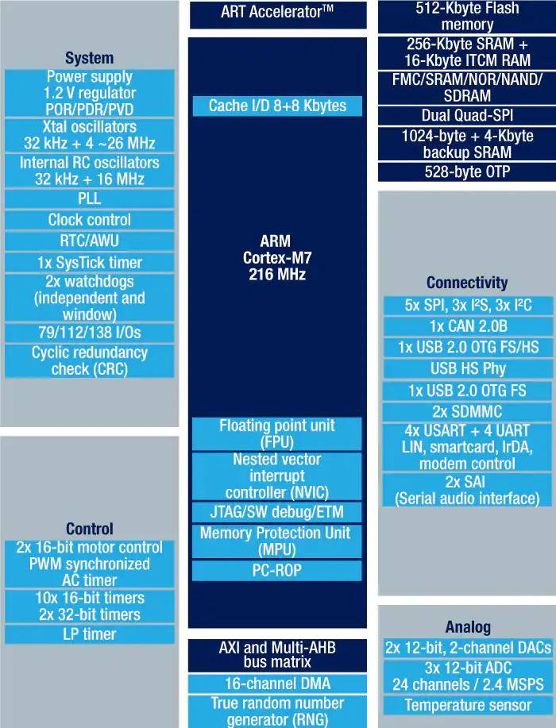

## Node
Device in charge of collect data from sensors to be delivered to the Gateway throughout Lora protocol.  

Also this device can works independently using the WiFi interface to upload directly the data to the cloud.
## Overview

## Microcontroller
  *STM32F723ZET6*  
  
- [Datasheet](https://www.st.com/resource/en/datasheet/stm32f722ic.pdf)
- Oscilators:  
  - 25 MHz: main
  - 32.768KHz: for 32bit
- Interfaces used:
  - SDMMC1: micro SD
  - QUADSPI_BK1: Flash memory 128Mbit
  - I2C1: I2C for sensors
  - OTG_HS: USB C connector
  - UART7: RS485 for sensors
  - UART4: WiFi microcontroller
  - I2C2: I2C for electrical power system
  - SWD: SWD connector

## Peripherals
- QSPI Flash memory 128Mbits
- RS485 interface
- microSD holder
- USB C connector
- SWD connector
- I2C connector

## Wireless
- ESP32_C3:
  - USB C connector
  - Reset and Boot buttons
- LORA_1278_433MHz:
  - SMA Connector Receptacle

## Electrical Power system
  

