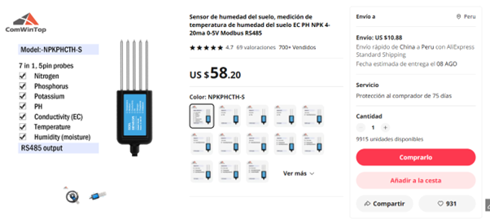

# Sensors

## Air quality
- HKNA Air quality detector WIFI RS485 (RS-MG111-*-1)  
  
  [Provider](https://es.aliexpress.com/item/1005004700732022.html?spm=a2g0o.productlist.main.27.289f1acaqG7Ga5&algo_pvid=e8e8c442-f8b9-45da-b07a-99ac7c71d158&algo_exp_id=e8e8c442-f8b9-45da-b07a-99ac7c71d158-13&pdp_npi=3%40dis%21USD%21393.25%21393.25%21%21%21393.25%21%21%402102176616888718768375061d072a%2112000030150266818%21sea%21PE%210&curPageLogUid=HYhTUP48xlpo)

- ComWinTop Air quality Sensor RS485 (CWT-SAQ-X-CH)  
  
  [Provider](https://es.aliexpress.com/item/1005003202262914.html?spm=a2g0o.productlist.main.1.289f1acaqG7Ga5&algo_pvid=f7987a4a-3f53-42a4-b9ed-00a41c016343&algo_exp_id=f7987a4a-3f53-42a4-b9ed-00a41c016343-0&pdp_npi=3%40dis%21USD%21106.80%21106.8%21%21%21106.80%21%21%4021021f7b16888721095795250d0777%2112000024638023350%21sea%21PE%210&curPageLogUid=16Czjuy399rD)

## Soil
- ComWinTop Soil Sensor RS485 (CWT-soil)  
  
  [Provider](https://www.aliexpress.com/item/1005001524845572.html?spm=a2g0o.productlist.main.9.15524978k3U0xQ&algo_pvid=f4a6a76f-3d18-43a1-acd1-22c692750138&aem_p4p_detail=202306291619081244771140175420002236042&algo_exp_id=f4a6a76f-3d18-43a1-acd1-22c692750138-4&pdp_npi=3%40dis%21USD%2158.2%2158.2%21%21%21%21%21%40212279a216880807484154411d07dc%2112000033906906281%21sea%21PE%210&curPageLogUid=Ekkg42sYhgAW&search_p4p_id=202306291619081244771140175420002236042_1)